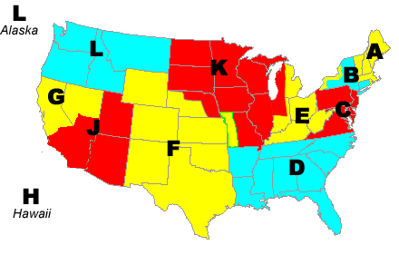
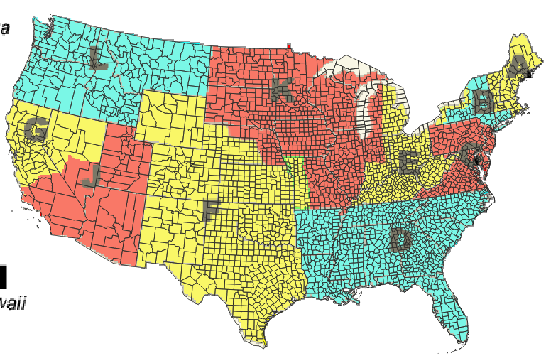
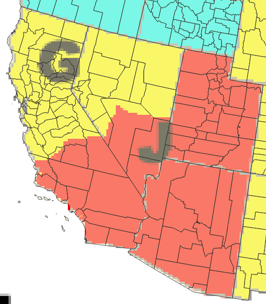
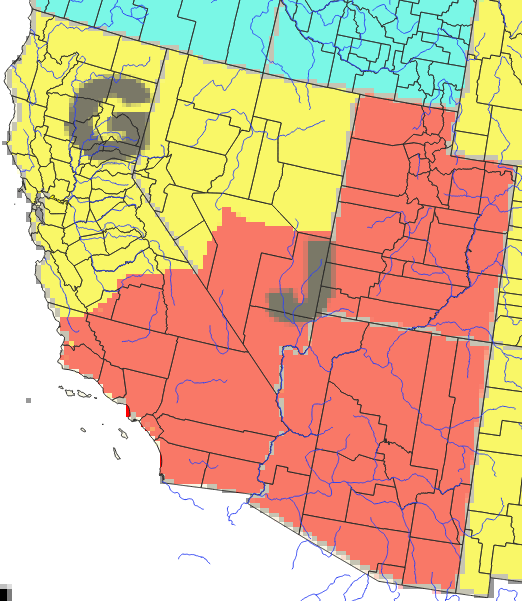
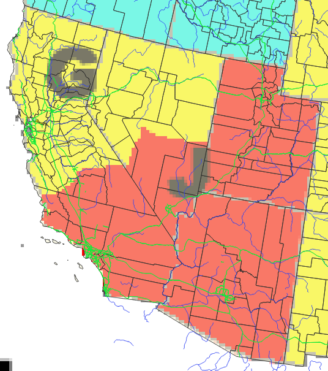

# US Sailing Region Map

I wanted to better understand the boundaries of US Sailing Regions, so
I've georeferenced the GIF map US Sailing provides to look for how
that lines up with counties and other features.

I was not successful, and suspect the boundaries are defined in a
document with much more complex rules than simply listing which
counties are in which US Sailing Area. So I'm pubishing to help the
next person.

My guess is these boundaries are defined in a document somewhere that
says things like "Area E includes Michigan lying east of a line drawn
south from the boundary of lakes Michigan and Superior; the waters of
Lake Superior, Lake Erie, and Lake Ontario and NNN miles inland from
those lakes, excluding Pennsylvania, all of the states of Ohio and
West Virginia and Kentucky, and Indiana something something
something." But I haven't been able to find that document.

# Steps

I'm trying to better understand the "Area G" area, so I've grabbed the
US Sailing map:

Notice the boundary between G and J cuts across the middle of
California and through Nevada.

I'd assumed that the boundary followed county boundaries, but it's not
obvious, so I georeferenced the US Sailing map by overlaying it on states
and counties from US Census Tiger Line files, clipped with Natural Earth 10m
data to exclude offshore areas:

Zooming in to Areas G and J:

... it does not look like the US Sailing Area G vs Area J boundary
follows county lines.

So then I thought I'd look at rivers: maybe it is like "right bank" vs
"left bank". So I drew all the major rivers in blue. And even "minor"
rivers. And I had this:

That didn't look right either.

So then I thought it might be bounded by major highways, and I added those in green:

# Use

To use this you'll need to un-xz the
US_CONUS_counties_clipped_to_NE_Land.geojson file, and open in
QGIS. Then point QGIS at the local copies of each layer.

# Update

I have heard that US Sailing defined the areas by zip code a long time
ago, but the list of which areas have which zip codes is not
available. It would be a long list: there's something like 40,000 zip
codes.

In the effort to find older zipcode data, I stumbled across a nice
blog post that might be worth a read:

[ZIP Codes are Not Areas](https://manifold.net/doc/mfd9/index.htm#zip_codes_are_not_areas.htm).

Which leads to a ZCTA5 overlay that looks like the following if you download
the 2022 ZCTA tiger line files.

# Credits

Data here comes from:

* US Sailing
* US Census Tiger Line files
* Natural Earth

# License

CC-BY-4.0

See [https://creativecommons.org/licenses/by/4.0/](https://creativecommons.org/licenses/by/4.0/)